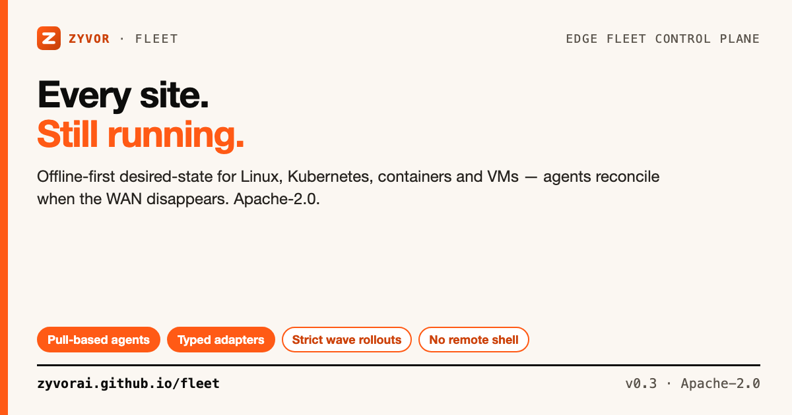

# Fleet

[](https://github.com/zyvorai/fleet/actions/workflows/ci.yml)
[](LICENSE)
[](go.mod)
[](docs/PRODUCT_PLAN.md)



**Every site. Still running.**

📖 **[Read the full docs](https://zyvorai.github.io/fleet/)** — tutorial, deployment, runtime adapters, and production runbooks.

Offline-first edge fleet control plane for Linux, Kubernetes, containers and virtual machines. The control plane declares what should run. A small `fleet-agent` pulls that desired state, caches the complete revision locally, and keeps reconciling it when the WAN disappears — with no arbitrary remote shell.

```text
                       ZYVOR FLEET CONTROL PLANE
                     UI · API · RBAC · rollouts
                                  │
                      pull / heartbeat / replay
                                  │
              ┌───────────────────┼───────────────────┐
              │                   │                   │
          Site Pune           Site Delhi          Site Tokyo
          fleet-agent         fleet-agent         fleet-agent
              │                   │                   │
       ┌──────┼──────┐      ┌─────┼─────┐       ┌────┼─────┐
     systemd container k3s   k3s container      QEMU systemd GPU

        WAN down? Each agent continues from its cached desired revision.
```

## Contents

- [Why this is a separate Zyvor product](#why-this-is-a-separate-zyvor-product)
- [Is this for you?](#is-this-for-you)
- [Capabilities](#capabilities)
- [Quick start](#quick-start)
- [Desired-state example](#desired-state-example)
- [Offline autonomy](#offline-autonomy)
- [Architecture](#architecture)
- [Kubernetes](#kubernetes)
- [Security](#security)
- [Documentation](#documentation)
- [License](#license)

## Why this is a separate Zyvor product

Zyvor already has strong point products. Fleet is the **site lifecycle and desired-state layer** that connects them.

| Product | Owns | Fleet relationship |
|---|---|---|
| **Nodra** | MQTT/HTTP edge ingress, store-and-forward, twins, local routes | Optional edge-data plane |
| **Zyvor Relay** | Durable operational action/ack/verify workflow | Optional action bus |
| **PacketWolf** | eBPF network intelligence | Optional network health/policy evidence |
| **Argus** | Application assurance | Optional post-rollout verification |
| **Forge** | GPU/inference operations | Optional edge AI plane |
| **HyperCluster** | Kubernetes cluster lifecycle | Fleet can coordinate site-level promotion |
| **IronWolf** | Bare-metal lifecycle | Fleet can represent/target the resulting sites |
| **Zeus OS / Machina** | VM operations | Fleet handles cross-site desired-state rollout |

Fleet intentionally does **not** reimplement Nodra's device/event data plane or Fabric's private-cloud VM control plane.

## Is this for you?

Zyvor Fleet is a small, open-source (Apache-2.0) site lifecycle/desired-state control plane: declare what should run across systemd/container/k3s/QEMU targets, and a small on-site agent keeps reconciling — including fully offline — with no arbitrary remote shell. It is not a data/event plane (that's Nodra), not a general-purpose config management tool, and not a cloud-vendor device registry.

| | **Zyvor Fleet** | balena | Azure IoT Hub Device Mgmt | AWS IoT Device Mgmt | Rancher/Fleet (k8s) | Ansible/SaltStack |
|---|---|---|---|---|---|---|
| Primary scope | Cross-runtime site desired-state + offline reconciliation | Container fleet + OTA via balenaCloud | Cloud device twin/management | Cloud device fleet indexing/jobs | Kubernetes cluster/app fleet only | Generic config push, no offline reconciliation loop |
| Runtime targets | systemd, container (Docker/Podman), k3s, QEMU/KVM | balenaOS containers only | SDK-built | SDK-built | Kubernetes only | Anything reachable over SSH/agent |
| Offline autonomy | First-class — agent caches the full desired revision | Limited — designed around balenaCloud connectivity | Requires connectivity | Requires connectivity | Requires API server reachability | Push-based; no continuous offline loop |
| Cloud dependency | None required | balenaCloud (proprietary) | Azure IoT Hub | AWS IoT Core | Kubernetes API (self-hostable) | None, but no fleet control plane |
| License | Apache-2.0 | Apache-2.0 agent + proprietary cloud | Proprietary | Proprietary | Apache-2.0 | Open-source core + commercial tiers |
| HA control plane | Not yet — v0.3 is single-writer | Managed | Managed | Managed | Kubernetes-native HA | N/A |

*(General characterizations as of writing — verify against each project's own docs.)*

> **Maturity (honest):** v0.3 is a serious single-writer release. A transactional HA storage adapter is a **future** milestone ([docs/PRODUCT_PLAN.md](docs/PRODUCT_PLAN.md)), alongside signed artifacts, agent OTA, and air-gap OCI bundles — not present yet. Device Agent and OTA contract surfaces are real (see below). Nodra relationship remains architectural — no code integration in this repository today.

**Integrations that ship today**

- **Device Agent** — opt-in `-device-agent-url` merges namespaced hardware metadata into heartbeats; failure never blocks a heartbeat.
- **Zyvor OTA** — `/v1/devices/{id}/assignment` and `/events` with digest-bound device tokens ([docs/OTA_CONTRACT.md](docs/OTA_CONTRACT.md)).

New here? [`docs/FAQ.md`](docs/FAQ.md) · [`docs/TROUBLESHOOTING.md`](docs/TROUBLESHOOTING.md)

## Capabilities

### Control plane

- Embedded Zyvor console (no CDN) · email/password + PBKDF2 · signed HttpOnly sessions · RBAC
- Enrollment tokens → independent per-site identities
- Live inventory, site cordons, scoped API tokens, HMAC-signed webhooks, bounded audit trail
- Declarative revisions, dynamic label groups, strict wave rollouts (approval, windows, failure budgets, pause/resume/abort/retry, rollback)
- Prometheus `/metrics` · single-writer atomic JSON persistence · one `fleetd` binary

### Offline-first agent

- Pull-based: no inbound management port on the site
- Complete desired revision cached locally (`0600`)
- Local reconciling continues through WAN loss; events queue and replay
- Per-site bearer identity (enrollment token is not reused)
- No generic server-triggered shell

### Typed runtime adapters

| Kind | Behavior | Safety boundary |
|---|---|---|
| `systemd` | Start/stop a named unit | Validated unit name; `systemctl` only |
| `container` | Run/replace/stop Docker or Podman | Declared image/env/ports/args only |
| `k3s` | Atomically maintain a k3s manifest | Validated name; explicit manifest content |
| `qemu` | Start/stop a basic KVM/QEMU VM | Disabled by default; absolute disk path required |

## Quick start

Requirements: Go 1.27+.

```bash
git clone https://github.com/zyvorai/fleet.git
cd fleet
make check && make build
```

### Start the control plane

```bash
export ZYVOR_FLEET_ADMIN_PASSWORD='zyvor-fleet-demo'
export ZYVOR_FLEET_SESSION_SECRET='local-demo-session-secret-change-me-1234567890'

./bin/fleetd --demo
```

Open **http://127.0.0.1:8080** — `admin@zyvor.local` / `zyvor-fleet-demo`. Demo enrollment token: `zf_enroll_demo-local-only`. `--demo` is not for production.

### Enroll a site

```bash
export ZYVOR_FLEET_ENROLLMENT_TOKEN='zf_enroll_demo-local-only'

./bin/fleet-agent \
  --server http://CONTROL_PLANE:8080 \
  --name factory-pune-01 \
  --region india-west \
  --labels class=factory,tier=production
```

### CLI

```bash
fleetctl status          # colorful logo; needs a running fleetd
fleetctl status json
fleetctl sites | events | revisions | rollouts | groups | audit | webhooks
fleetctl group-create "Production" env=production,class=factory
fleetctl rollout-plan GROUP_ID
fleetctl site-maintenance SITE_ID on "scheduled service"
fleetctl api-token-create github-ci operator read,rollouts:write
fleetctl enroll-token "Factory install"
```

Guided walkthrough: [docs/TUTORIAL.md](docs/TUTORIAL.md).

## Desired-state example

```json
{
  "name": "Factory stack 2026.09",
  "notes": "Promote edge API and maintain time sync",
  "workloads": [
    {"kind": "systemd", "name": "chronyd", "state": "running"},
    {
      "kind": "container",
      "name": "edge-api",
      "state": "running",
      "image": "ghcr.io/example/edge-api:1.4.0",
      "ports": ["8081:8080"]
    },
    {
      "kind": "k3s",
      "name": "local-inference",
      "state": "running",
      "manifest": "apiVersion: apps/v1\nkind: Deployment\n..."
    }
  ]
}
```

Create the revision in the UI, target sites or a dynamic group, preview the rollout plan, set wave/failure/approval/window policy and start. A strict wave does not advance until every site in the active wave has reported success or failure.

## Offline autonomy

When sync fails:

1. The agent marks the connectivity transition once.
2. The cached revision remains authoritative locally.
3. Typed adapters continue drift reconciliation.
4. Events stay on disk.
5. When the control plane returns, queued events replay through the next heartbeat.
6. Any newer desired revision is then reconciled.

No cloud/control-plane call is necessary to keep the last accepted desired state alive.

## Architecture

```text
Browser
   │ HTTPS
   ▼
┌──────────────────────────────────────────────┐
│ fleetd                                       │
│ embedded web UI · REST API · rollout engine  │
│ auth / RBAC · single-writer store            │
└──────────────────┬───────────────────────────┘
                   │ outbound pull from sites
         ┌─────────┴─────────┐
         ▼                   ▼
    fleet-agent          fleet-agent
    typed adapters       typed adapters
```

v0.3 is deliberately a **single-writer** control plane. Kubernetes deploys one replica with a `ReadWriteOnce` volume. HA storage is a later milestone.

See [ARCHITECTURE.md](ARCHITECTURE.md) and [docs/V0.3_OPERATIONS.md](docs/V0.3_OPERATIONS.md).

## Kubernetes

```bash
helm upgrade --install zyvor-fleet ./deploy/helm/zyvor-fleet \
  --namespace zyvor-fleet --create-namespace \
  --set admin.password='CHANGE_ME' \
  --set sessionSecret="$(openssl rand -base64 48)"

# Optional in-cluster node agent
helm upgrade --install zyvor-fleet ./deploy/helm/zyvor-fleet \
  --namespace zyvor-fleet --create-namespace \
  --set admin.password='CHANGE_ME' \
  --set sessionSecret="$(openssl rand -base64 48)" \
  --set agent.enabled=true \
  --set agent.enrollmentToken='YOUR_TOKEN'
```

Ordinary remote edge boxes: install `fleet-agent` on the site, not as a DaemonSet. Raw manifests: `kubectl apply -k deploy/kubernetes` (copy `secret.example.yaml` first).

Compose demo: `docker compose up --build` (control plane + two simulated sites).

## Security

- Explicit admin password for production bootstrap; session secret 32+ bytes
- HttpOnly + SameSite Strict cookies; scoped bearer tokens as SHA-256 digests only
- HMAC-SHA256 signed webhooks; bounded audit trail without request bodies
- State files `0600`; login throttling; CSP denies third-party scripts
- No arbitrary shell workload type; QEMU opt-in (`ZYVOR_FLEET_ALLOW_QEMU=1`)

See [SECURITY.md](SECURITY.md).

## Product plan

**v0.3** ships site cordons, scoped API tokens, signed webhooks, and a bounded audit trail. Next: signed artifacts, agent OTA, air-gap OCI bundles, enterprise identity, transactional HA storage — [docs/PRODUCT_PLAN.md](docs/PRODUCT_PLAN.md).

## Documentation

| Doc | Topic |
|---|---|
| [zyvorai.github.io/fleet](https://zyvorai.github.io/fleet/) | Product docs |
| [docs/TUTORIAL.md](docs/TUTORIAL.md) | Guided first rollout |
| [docs/FAQ.md](docs/FAQ.md) | Licensing, support, readiness |
| [docs/DEPLOYMENT.md](docs/DEPLOYMENT.md) | Systemd, Compose, Helm |
| [docs/RUNTIME_ADAPTERS.md](docs/RUNTIME_ADAPTERS.md) | Workload kinds |
| [ARCHITECTURE.md](ARCHITECTURE.md) | Protocol and failure model |
| [docs/PRODUCTION.md](docs/PRODUCTION.md) | Production runbook |
| [docs/OTA_CONTRACT.md](docs/OTA_CONTRACT.md) | OTA assignment + events |
| [docs/openapi.yaml](docs/openapi.yaml) | REST API |

Social assets: [docs/social/](docs/social/).

## Testing

```bash
make check && make test-race && make live-smoke && make qualify
```

CI: formatting, `go vet`, race tests, JS syntax, all binaries — plus rollout lifecycle, health gates, rollback/retry, and typed adapter drift.

## License

### Open source (Apache-2.0)

Licensed under the [Apache License, Version 2.0](LICENSE). Personal, lab, and commercial production use at no charge, subject to Apache-2.0 (preserve notices / NOTICE where required).

### Enterprise

Production support, SLAs, and Zyvor Enterprise products are licensed separately.
Contact [sales@zyvor.dev](mailto:sales@zyvor.dev) or see [zyvor.dev](https://zyvor.dev).
